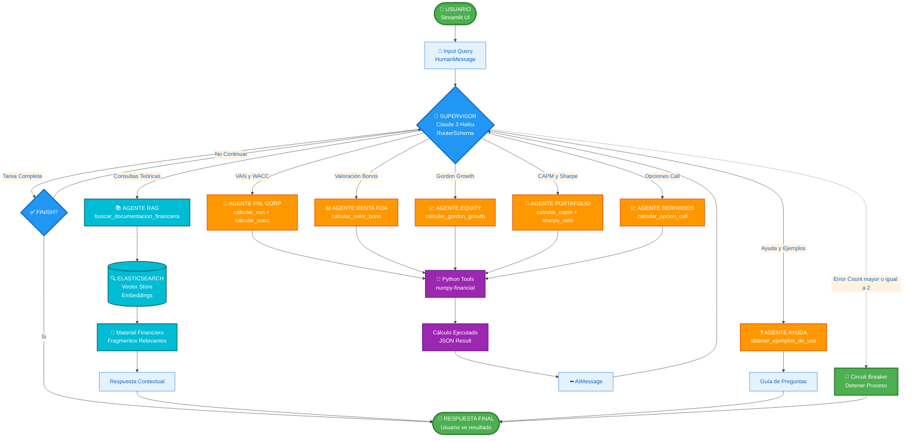

# 💰 Agente Financiero Inteligente (Calculadora CFA - MVP)

Una aplicación web interactiva construida con Streamlit y LangGraph que actúa como un agente financiero inteligente. Es capaz de realizar diversos cálculos financieros estilo CFA mediante una arquitectura multi-agente supervisada con sistema RAG integrado.

## 📋 Tabla de Contenidos
1.  [Características](#-características-mvp)
2.  [Arquitectura](#️-arquitectura)
3.  [Ejemplos de Uso](#-ejemplos-de-uso-guía-de-preguntas)
4.  [Instalación Local](#-getting-started-localmente)
5.  [Despliegue](#️-despliegue-en-streamlit-cloud)
6.  [Estructura del Proyecto](#-estructura-del-proyecto)
7.  [¡Contribuye!](#-contribuye)
8.  [Licencia](#-licencia)

## ✨ Características (MVP)

* **Interfaz Web Interactiva:** Creada con Streamlit para facilitar las consultas.
* **Arquitectura Multi-Agente:** Utiliza LangGraph con un agente "Supervisor" que direcciona las consultas al especialista adecuado.
* **Sistema RAG Integrado:** Búsqueda semántica en material financiero usando Elasticsearch + OpenAI Embeddings.
* **22 Herramientas Financieras de CFA Level I:**
    * **Renta Fija (6):** Valoración de Bonos, Duration Macaulay, Duration Modificada, Convexity, Current Yield, Bonos Cupón Cero
    * **Finanzas Corporativas (5):** VAN (NPV), WACC, TIR (IRR), Payback Period, Profitability Index
    * **Equity (1):** Gordon Growth Model (DDM)
    * **Portafolio (7):** CAPM, Sharpe Ratio, Treynor Ratio, Jensen's Alpha, Beta de Portafolio, Retorno Esperado, Desviación Estándar
    * **Derivados (3):** Opciones Call/Put (Black-Scholes), Put-Call Parity
* **8 Agentes Especialistas:**
    * Renta Fija, Finanzas Corporativas, Equity, Portafolio, Derivados
    * RAG (Consultas a material de estudio)
    * Síntesis RAG (Generación de respuestas contextuales)
    * Ayuda (Guía de uso)
* **Modelo de Lenguaje:** Impulsado por Anthropic Claude 3.5 Haiku (configurable).
* **Observabilidad:** Integración opcional con LangSmith para tracing y debugging.
* **Manejo de Errores:** Incluye un "Circuit Breaker" inteligente para evitar bucles infinitos.
* **Seguridad:** Configuración de API Keys mediante variables de entorno y Streamlit Secrets (no hardcodeado).
* **Código Estructurado:** Organizado en módulos para mejor mantenibilidad (`config`, `tools`, `agents`, `graph`, `rag`).

## 🏛️ Arquitectura



### Flujo de Ejecución:

1.  El usuario ingresa una consulta en la interfaz de Streamlit.
2.  El agente **Supervisor** recibe la consulta y, basado en su contenido y el historial, decide qué agente especialista debe manejarla.
3.  El **Agente Especialista** (ej. `Agente_Finanzas_Corp`) recibe la tarea, extrae los parámetros necesarios usando el LLM y ejecuta su herramienta específica (ej. `_calcular_van`).
4.  El resultado de la herramienta se devuelve al agente especialista.
5.  El agente especialista formula una respuesta final y la devuelve al Supervisor.
6.  El Supervisor recibe la respuesta. Si la tarea está completa, decide `FINISH`.
7.  La respuesta final se muestra al usuario en Streamlit.

### Componentes Principales:
- **Portal de Entrada:** Streamlit UI para captura de consultas
- **Supervisor:** Orquestador inteligente con Claude 3.5 Haiku y Circuit Breaker
- **8 Agentes Especializados:** Renta Fija, Finanzas Corp, Equity, Portafolio, Derivados, RAG, Síntesis RAG, Ayuda
- **22 Python Tools:** Cálculos deterministas de CFA Level I con numpy/scipy
- **Sistema RAG:** Elasticsearch + OpenAI Embeddings para búsqueda semántica
- **MemorySaver:** Persistencia de contexto durante la sesión

## 🚀 Ejemplos de Uso (Guía de Preguntas)

Una vez que la aplicación esté corriendo, puedes usar estas consultas como ejemplo:

### Cálculos Financieros

* **Ayuda (Para ver la guía):**
    * `Ayuda`
    * `¿Qué puedes hacer?`

* **Finanzas Corporativas (5 herramientas):**
    * `Calcula el VAN de un proyecto. Inversión inicial 100,000. Flujos [30k, 40k, 50k] a 3 años. Tasa de descuento 10%.`
    * `Necesito calcular el WACC. Ke=12%, Kd=8%, E=60M, D=40M, y tasa impositiva 25%.`
    * `Calcula la TIR: inversión 100k, flujos [30k, 40k, 50k].`
    * `¿Cuál es el Payback Period? Inversión 50k, flujos [15k, 20k, 25k].`
    * `Calcula el Profitability Index con tasa 10%, inversión 80k, flujos [30k, 40k, 35k].`

* **Renta Fija (6 herramientas):**
    * `Precio de un bono: nominal 1,000, cupón 5% anual, 10 años, YTM 6%.`
    * `Calcula la Duration Macaulay: nominal 1000, cupón 6%, YTM 7%, 5 años, frecuencia semestral.`
    * `Duration Modificada con Macaulay Duration de 4.5 años, YTM 6%, frecuencia 2.`
    * `Calcula Convexity: nominal 1000, cupón 5%, YTM 6%, 10 años, semestral.`
    * `Current Yield: cupón anual $60, precio actual $950.`
    * `Valor de bono cupón cero: nominal 1000, YTM 5%, 10 años.`

* **Portafolio (7 herramientas):**
    * `¿Cuál es el costo de equity (Ke) usando CAPM? La tasa libre de riesgo es 3%, el beta es 1.2 y el retorno de mercado es 10%.`
    * `Calcula el Ratio de Sharpe. Retorno 15%, tasa libre de riesgo 4%, volatilidad 20%.`
    * `Treynor Ratio: retorno portafolio 12%, tasa libre riesgo 3%, beta 1.3.`
    * `Jensen's Alpha: retorno 14%, rf 4%, beta 1.1, retorno mercado 12%.`
    * `Beta de portafolio con 2 activos: pesos 0.6 y 0.4, betas 1.2 y 0.8.`
    * `Retorno esperado: pesos 0.7 y 0.3, retornos 10% y 15%.`
    * `Desviación estándar portafolio: pesos 0.5 y 0.5, std dev 20% y 25%, correlación 0.3.`

* **Equity (1 herramienta):**
    * `Valora una acción con Gordon Growth. El dividendo esperado (D1) es $2.50, el costo de equity (Ke) es 12%, y la tasa de crecimiento (g) es 4%.`

* **Derivados (3 herramientas):**
    * `Precio de opción call: S=100, K=105, T=0.5 años, r=5%, sigma=20%.`
    * `Precio de opción put: S=50, K=55, T=1 año, r=4%, sigma=30%.`
    * `Verifica Put-Call Parity: call=$5, put=$3, spot=$100, strike=$100, T=1, r=5%.`

### Consultas a Material de Estudio (RAG)

* `¿Qué dice el material sobre el WACC?`
* `Explica el concepto de Duration`
* `Busca información sobre el modelo Gordon Growth`
* `¿Qué es el Beta?`
* `Explícame el concepto de Convexity`

## 🚀 Getting Started (Localmente)

Sigue estos pasos para ejecutar la aplicación en tu máquina local.

### Prerrequisitos

* **Python:** Versión 3.9 o superior recomendada.
* **Git:** Para clonar el repositorio.
* **Anthropic API Key:** Necesitas una clave API de Anthropic.
* **(Opcional) LangSmith API Key:** Para observabilidad y debugging.

### Pasos de Instalación

1.  **Clonar el Repositorio:**
    ```bash
    git clone https://github.com/TU_USUARIO/TU_REPOSITORIO.git
    cd TU_REPOSITORIO
    ```

2.  **Crear y Activar Entorno Virtual:** (Altamente recomendado)
    ```bash
    # Crear entorno
    python -m venv venv
    
    # Activar entorno
    # Windows (CMD/PowerShell)
    .\venv\Scripts\activate
    # macOS/Linux
    source venv/bin/activate
    ```
    Deberías ver `(venv)` al inicio de tu prompt.

3.  **Instalar Dependencias:**
    ```bash
    pip install -r requirements.txt
    ```

4.  **Configurar API Keys y Elasticsearch (Local):**
    * Crea un archivo llamado `.env` en la raíz del proyecto.
    * Añade tus API keys y credenciales de Elasticsearch dentro de este archivo:
        ```ini
        # .env
        ANTHROPIC_API_KEY="sk-ant-api03-..."
        LANGSMITH_API_KEY="lsv2_pt_..."  # Opcional
        LANGCHAIN_PROJECT="financial-agent-dev"  # Opcional
        
        # Elasticsearch Configuration
        ES_HOST="tu-servidor-elasticsearch.com"
        ES_PORT="9200"
        ES_USERNAME="elastic"
        ES_PASSWORD="tu-contraseña-segura"
        ES_SCHEME="https"
        ES_INDEX_NAME="cfa_documents"
        ```
    * **IMPORTANTE:** Asegúrate de que el archivo `.env` esté listado en tu `.gitignore` para no subirlo accidentamente a GitHub.

5.  **(Opcional) Indexar Material Financiero en Elasticsearch:**
    * Si tienes material financiero para indexar:
    ```bash
    # Crear directorio para documentos
    mkdir -p data/cfa_books

    # Copiar tus PDFs de material financiero ahí
    # Luego ejecutar el indexador (requiere permisos de admin)
    python admin/generate_index.py
    ```
    * **Nota:** Asegúrate de tener Elasticsearch corriendo y configurado correctamente.

### Ejecutar la Aplicación

1.  Asegúrate de que tu entorno virtual esté activado.
2.  Ejecuta Streamlit desde la carpeta raíz del proyecto:
    ```bash
    streamlit run streamlit_app.py
    ```
3.  Abre tu navegador y ve a la dirección que indique Streamlit (normalmente `http://localhost:8501`).

## ☁️ Despliegue en Streamlit Cloud

1.  **Sube tu Código a GitHub:** Asegúrate de que tu repositorio esté actualizado en GitHub (`git push`), **sin** incluir el archivo `.env` ni la carpeta `venv`.
2.  **Conecta Streamlit Cloud:**
    * Ve a `share.streamlit.io` y haz clic en "New app".
    * Selecciona tu repositorio de GitHub, la rama (`main`) y el archivo principal (`streamlit_app.py`).
3.  **Configura los Secrets:**
    * Antes de hacer clic en "Deploy!", ve a "Advanced settings..." > "Secrets".
    * Pega tus API keys y configuración de Elasticsearch usando el formato TOML:
        ```toml
        ANTHROPIC_API_KEY = "sk-ant-api03-..." 
        LANGSMITH_API_KEY = "lsv2_pt_..."  # Opcional
        LANGCHAIN_PROJECT = "financial-agent-prod"  # Opcional
        
        # Elasticsearch
        ES_HOST = "tu-servidor-elasticsearch.com"
        ES_PORT = "9200"
        ES_USERNAME = "elastic"
        ES_PASSWORD = "tu-contraseña-segura"
        ES_SCHEME = "https"
        ES_INDEX_NAME = "cfa_documents"
        ```
    * Guarda los secretos.
4.  **Deploy:** Haz clic en "Deploy!".

## 📁 Estructura del Proyecto

El repositorio está organizado de forma modular para facilitar la mantenibilidad y la adición de nuevos agentes o herramientas:

```bash
tu_repositorio/
├── agents/                 # Define los agentes especialistas y el supervisor
│   ├── __init__.py
│   └── financial_agents.py
├── graph/                  # Construye y compila el StateGraph de LangGraph
│   ├── __init__.py
│   └── agent_graph.py
├── tools/                  # Define las @tools (funciones de cálculo)
│   ├── __init__.py
│   ├── financial_tools.py
│   ├── help_tools.py
│   └── schemas.py          # Pydantic schemas para las tools
├── rag/                    # Sistema RAG con Elasticsearch
│   ├── __init__.py
│   └── financial_rag_elasticsearch.py  # RAG usando Elasticsearch como vector store
├── admin/                  # Scripts de administración
│   └── generate_index.py   # Indexador de material financiero
├── data/                   # Datos persistentes (no en repo)
│   └── cfa_books/         # PDFs de material financiero
├── config.py              # Configuración (LLM, API keys, LangSmith)
├── config_elasticsearch.py # Configuración (legacy, no usado actualmente)
├── database/              # Conexión a BD (opcional, no usado en MVP)
│   └── connection.py
├── requirements.txt       # Dependencias del proyecto
├── streamlit_app.py       # El punto de entrada de la app web
├── .env.example          # Ejemplo de variables de entorno
├── .gitignore            # Archivos a ignorar
└── README.md             # Esta documentación
```

## 🤝 ¡Contribuye!

¡Este es un proyecto abierto y las contribuciones son bienvenidas! La arquitectura está diseñada para que añadir nuevas herramientas sea fácil.

Si te gustaría contribuir (por ejemplo, añadiendo nuevas calculadoras financieras):

1.  Haz un **Fork** del repositorio.
2.  Crea una nueva rama (`git checkout -b feature/nueva-calculadora`).
3.  Añade tu nueva `@tool` en `tools/financial_tools.py`.
4.  Crea el schema Pydantic correspondiente en `tools/schemas.py`.
5.  (Opcional pero recomendado) Crea un nuevo `Agente_Especialista` en `agents/financial_agents.py` y añádelo al `agent_nodes`.
6.  Actualiza el `supervisor_system_prompt` para que sepa de tu nueva herramienta.
7.  Haz **Commit** y **Push** de tus cambios.
8.  Abre un **Pull Request**.

## 📜 Licencia

Este proyecto está bajo la Licencia MIT.

---

**Stack Tecnológico:**
- LangChain 0.3.0+
- LangGraph 0.2.0+
- Anthropic Claude 3.5 Haiku
- Streamlit 1.39+
- Elasticsearch 8.15+ (Vector Store)
- HuggingFace Embeddings (sentence-transformers)
- Pydantic 2.0
- NumPy, SciPy, numpy-financial
- LangSmith (Opcional)